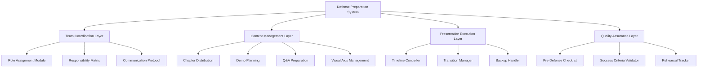
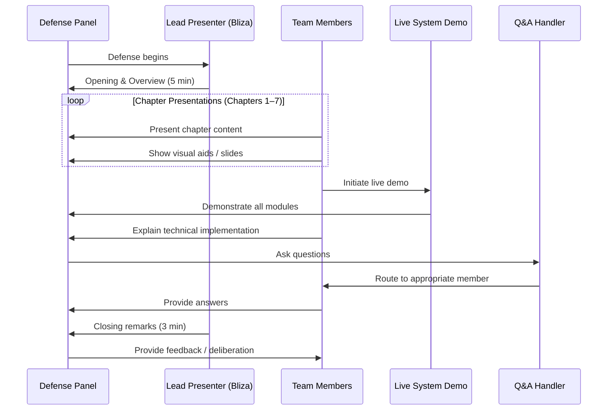

# Design Document: Research Defense Preparation

## Overview

The Research Defense Preparation system is a comprehensive planning and execution framework for the SSG Office Assistant App capstone project defense scheduled for **Monday, May 5, 2026**. This design establishes a structured approach to coordinate six team members — **Bliza, Frances, Raniza, Justin, Elijah, and Reyvehn** — through a 60–75 minute defense presentation covering seven research chapters, a live system demonstration, and a Q&A session.

The framework covers role assignment, content distribution, timeline management, visual aids preparation, anticipated question handling, and contingency planning to ensure a cohesive and professional defense.

---

## System Being Defended

**Project Title:** SSG Office Assistant App — A Digital Management System for Student Government Operations

**Tech Stack:**
- Frontend: React (Vite), CSS Modules
- Backend/Database: Firebase Firestore
- Routing: React Router
- State Management: React Context API (CardContext, AuthContext, FinanceContext, InventoryContext)
- Hosting: (to be confirmed)

**Core Modules:**
| Module | Description |
|---|---|
| Member Management | Add, view, edit, delete student member profiles |
| Product Management | Manage SSG merchandise/products |
| Order Management | Process and track student orders |
| Finance / Budget | Budget tracking, analytics, and reporting |
| Inventory Dashboard | Stock monitoring and management |
| Document Management | PDF upload and dashboard |
| Announcements | Post and manage SSG announcements |
| Admin Panel | Role-based access and admin controls |
| Homepage | Public-facing landing page |

---

## Architecture



---

## Main Defense Flow



---

## Team Roles and Responsibilities

### Role Assignment Matrix

| Member | Primary Role | Chapters / Sections | Backup Role |
|---|---|---|---|
| **Bliza** | Lead Presenter / Emcee | Opening, Closing, Chapter 1 (Introduction) | Q&A Coordinator |
| **Frances** | Research Presenter | Chapter 2 (Review of Related Literature), Chapter 3 (Methodology) | Visual Aids Handler |
| **Raniza** | Research Presenter | Chapter 4 (Results & Discussion — Part 1) | Timer |
| **Justin** | Technical Presenter | Chapter 5 (Results & Discussion — Part 2 / System Features) | Live Demo Backup |
| **Elijah** | Live Demo Operator | Chapter 6 (Summary, Conclusions, Recommendations) | Technical Q&A |
| **Reyvehn** | Q&A Coordinator / Support | Chapter 7 (References / Appendices overview), Q&A facilitation | Slide Operator |

> **Note:** Chapters 4 and 5 cover the system's core features and technical implementation — these are the most likely targets for panel questions.

---

## Chapter Breakdown and Presentation Plan

### Chapter 1 — Introduction *(Bliza, ~5 min)*
- Background of the study
- Statement of the problem
- Objectives of the study
- Significance of the study
- Scope and limitations
- Definition of terms

**Key talking points:**
- Why the SSG needed a digital management system
- Manual processes that were replaced
- Target users: SSG officers and student body

---

### Chapter 2 — Review of Related Literature *(Frances, ~7 min)*
- Local and foreign studies on student organization management systems
- Related systems and technologies (React, Firebase, similar admin dashboards)
- Synthesis of the literature
- Gaps addressed by this study

**Key talking points:**
- How existing systems informed the design
- Why React + Firebase was the appropriate tech choice
- Theoretical frameworks used

---

### Chapter 3 — Methodology *(Frances, ~7 min)*
- Research design (Agile/iterative development)
- System development methodology (SDLC model used)
- Data gathering procedures
- Respondents / stakeholders
- Instruments used (surveys, interviews)
- Statistical treatment

**Key talking points:**
- How the team gathered requirements from SSG officers
- Development phases: planning → design → development → testing → deployment
- Validation approach

---

### Chapter 4 — Results & Discussion Part 1: System Features *(Raniza, ~8 min)*
- Member Management module walkthrough
- Product Management module
- Order Management module
- Announcement module
- Homepage / public interface

**Key talking points:**
- How each module addresses a specific SSG pain point
- UI/UX decisions made
- Firebase Firestore data structure for members and products

---

### Chapter 5 — Results & Discussion Part 2: Technical Implementation *(Justin, ~8 min)*
- React component architecture
- Client-side routing (React Router)
- Firebase integration (Firestore CRUD operations)
- State management (CardContext, AuthContext, FinanceContext, InventoryContext)
- Finance / Budget module
- Inventory Dashboard
- Document (PDF) management
- Admin panel and role-based access

**Key talking points:**
- How Context API manages shared state across modules
- Firebase security rules and authentication
- How the system handles real-time data updates

---

### Chapter 6 — Summary, Conclusions, and Recommendations *(Elijah, ~5 min)*
- Summary of findings
- Conclusions drawn from the study
- Recommendations for future development
- Limitations encountered

**Key talking points:**
- What the system successfully achieved
- Areas for improvement (e.g., mobile responsiveness, offline support)
- Potential future features (notifications, reporting exports)

---

### Chapter 7 — References & Appendices Overview *(Reyvehn, ~3 min)*
- Brief overview of references cited
- Appendices: survey instruments, screenshots, user acceptance testing results
- Acknowledgment of validators/evaluators

---

## Live System Demonstration Plan

**Operator:** Elijah (primary), Justin (backup)
**Duration:** ~10–12 minutes
**Environment:** Localhost or deployed URL on laptop connected to projector

### Demo Script

| Step | Action | Module | Presenter Notes |
|---|---|---|---|
| 1 | Open the app homepage | Homepage | Show public-facing landing page |
| 2 | Log in as admin | Login / Auth | Demonstrate role-based access |
| 3 | Navigate to Member Management | Member Dashboard | Add a sample member, show list view |
| 4 | Navigate to Product Management | Products | Show product list, add/edit a product |
| 5 | Navigate to Order Management | Orders | Show order processing flow |
| 6 | Navigate to Finance / Budget | Finance Dashboard | Show budget tracking and analytics |
| 7 | Navigate to Inventory | Inventory Dashboard | Show stock levels |
| 8 | Navigate to Documents | PDF Dashboard | Upload or view a document |
| 9 | Navigate to Announcements | Announcements | Show announcement posting |
| 10 | Show Admin Panel | Admin | Demonstrate admin controls |

**Backup Plan:** If live demo fails, use pre-recorded screen capture video or static screenshots in slides.

---

## Anticipated Q&A Preparation

### Technical Questions

| Question | Assigned Responder | Key Points to Cover |
|---|---|---|
| Why did you choose React over other frameworks? | Justin | Component reusability, large ecosystem, Vite for fast builds |
| Why Firebase instead of a traditional backend? | Justin / Elijah | Real-time sync, no-server setup, free tier for academic projects |
| How does authentication work in your system? | Justin | Firebase Auth + AuthContext, protected routes |
| How is data structured in Firestore? | Elijah | Collections: members, products, orders, budgets, inventory |
| How does the Context API work in your app? | Justin | CardContext for cart/order state, FinanceContext for budget, InventoryContext for stock |
| What happens if Firebase is down? | Elijah | Acknowledge limitation; recommend offline persistence as future improvement |
| How did you handle role-based access? | Justin | Admin vs. regular user roles, ProtectedRoutes component |

### Research / Methodology Questions

| Question | Assigned Responder | Key Points to Cover |
|---|---|---|
| What is your research design? | Frances | Developmental research, SDLC-based |
| Who were your respondents? | Frances | SSG officers, student users |
| How did you validate the system? | Frances / Raniza | User acceptance testing, evaluation forms |
| What statistical tools did you use? | Frances | Weighted mean, Likert scale for evaluation |
| What are the limitations of your study? | Elijah | Scope limited to one institution, no mobile app version |

### Conceptual / Defense Questions

| Question | Assigned Responder | Key Points to Cover |
|---|---|---|
| What problem does this system solve? | Bliza | Manual SSG record-keeping, inefficient order processing |
| What is the significance of this study? | Bliza | Digitizes SSG operations, improves transparency and efficiency |
| What would you improve if given more time? | All (Elijah leads) | Mobile app, push notifications, advanced reporting |
| How is this different from existing systems? | Raniza | Tailored specifically for SSG operations, integrated modules |
| What did you learn from this project? | All (Bliza leads) | Teamwork, full-stack development, research methodology |

---

## Defense Timeline

```
[0:00 – 0:05]  Opening & Introduction of Team         — Bliza
[0:05 – 0:10]  Chapter 1: Introduction                — Bliza
[0:10 – 0:17]  Chapter 2: Review of Related Lit.      — Frances
[0:17 – 0:24]  Chapter 3: Methodology                 — Frances
[0:24 – 0:32]  Chapter 4: Results & Discussion Pt. 1  — Raniza
[0:32 – 0:40]  Chapter 5: Results & Discussion Pt. 2  — Justin
[0:40 – 0:45]  Chapter 6: Summary & Conclusions       — Elijah
[0:45 – 0:48]  Chapter 7: References & Appendices     — Reyvehn
[0:48 – 1:00]  Live System Demonstration              — Elijah / Justin
[1:00 – 1:15]  Q&A Session                            — All (Reyvehn coordinates)
[1:15 – 1:18]  Closing Remarks                        — Bliza
[1:18 – 1:20]  Panel Deliberation begins              — Panel
```

**Total estimated time: 75–80 minutes**

> **Timer:** Raniza monitors time. Give a subtle signal (e.g., hand gesture) at the 1-minute warning for each presenter.

---

## Visual Aids Checklist

### Slide Deck Requirements
- [ ] Title slide with project name, team names, institution, date
- [ ] Table of contents / agenda slide
- [ ] Chapter 1: Problem statement, objectives (bullet points)
- [ ] Chapter 2: Summary table of related literature
- [ ] Chapter 3: Methodology diagram / SDLC flowchart
- [ ] Chapter 4: Screenshots of Member, Product, Order, Announcement modules
- [ ] Chapter 5: System architecture diagram, component tree, Firebase structure
- [ ] Chapter 6: Summary table of findings, recommendations list
- [ ] Chapter 7: References slide
- [ ] Live demo transition slide ("Live Demonstration")
- [ ] Q&A slide ("Open Forum")
- [ ] Closing / Thank You slide

### Supporting Materials
- [ ] Printed copies of research paper (1 per panel member + 1 spare)
- [ ] Laptop with system running (tested day before)
- [ ] Backup laptop or USB with offline demo video
- [ ] HDMI cable / display adapter
- [ ] Clicker / slide advancer (optional)
- [ ] Timer (phone or watch)

---

## Pre-Defense Checklist

### 48 Hours Before (Saturday, May 3)
- [ ] Complete full rehearsal with all team members
- [ ] Time each section — adjust if over/under
- [ ] Finalize and proofread all slides
- [ ] Print research paper copies
- [ ] Test live system on defense laptop
- [ ] Record backup demo video

### 24 Hours Before (Sunday, May 4)
- [ ] Final slide review and corrections
- [ ] Confirm venue, time, and panel members
- [ ] Prepare formal attire
- [ ] Rest — avoid late-night cramming
- [ ] Review Q&A preparation notes individually

### Day Of (Monday, May 5)
- [ ] Arrive at venue 30–45 minutes early
- [ ] Set up laptop and projector — test display
- [ ] Open system and verify it loads correctly
- [ ] Do a quick 10-minute run-through of transitions
- [ ] Assign a water bottle / comfort items
- [ ] Silence phones (except timer phone)

---

## Contingency Plans

| Scenario | Response |
|---|---|
| Live demo crashes | Switch to backup video or screenshots in slides |
| Presenter loses track | Reyvehn or Bliza steps in to bridge |
| Panel asks a question no one can answer | Acknowledge honestly: "We will look into that further" — never guess |
| Projector fails | Continue verbally with printed paper copies |
| A team member is absent | Redistribute their chapter to the nearest presenter |
| Time runs over | Skip Chapter 7 details; Reyvehn summarizes in 1 minute |

---

## Success Criteria

| Criterion | Target |
|---|---|
| All 7 chapters presented | ✅ Every chapter covered |
| Live demo runs without critical failure | ✅ All major modules demonstrated |
| Q&A handled confidently | ✅ Each question answered by the right person |
| Total time within bounds | ✅ 60–80 minutes |
| Panel receives printed copies | ✅ Copies ready before defense starts |
| Team presents professionally | ✅ Formal attire, composed delivery |

---

## Team Preparation Tips

- **Practice transitions** — the handoff between presenters should feel natural, not abrupt
- **Know your chapter cold** — you don't need to memorize, but you should be able to speak without reading slides
- **Anticipate follow-up questions** — panels often dig deeper on methodology and technical choices
- **Stay calm during Q&A** — it's okay to pause and think before answering
- **Support each other** — if a teammate struggles, a brief assist is professional, not a sign of weakness
- **Bliza sets the tone** — a confident, warm opening sets the panel at ease and builds team confidence
