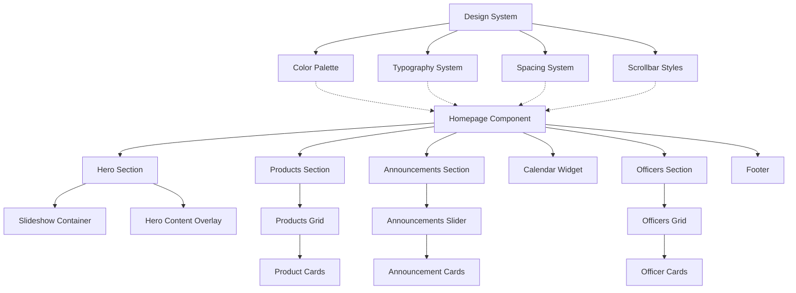
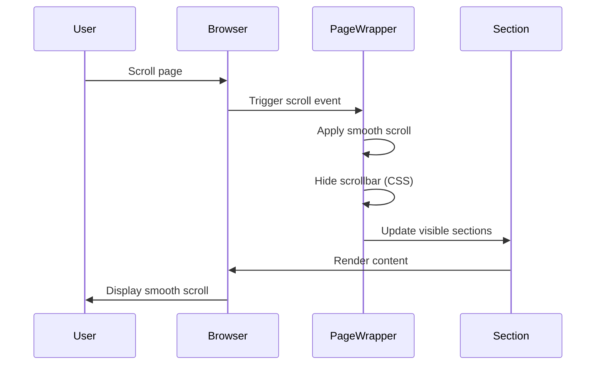
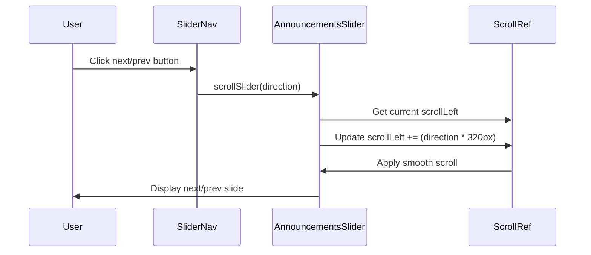
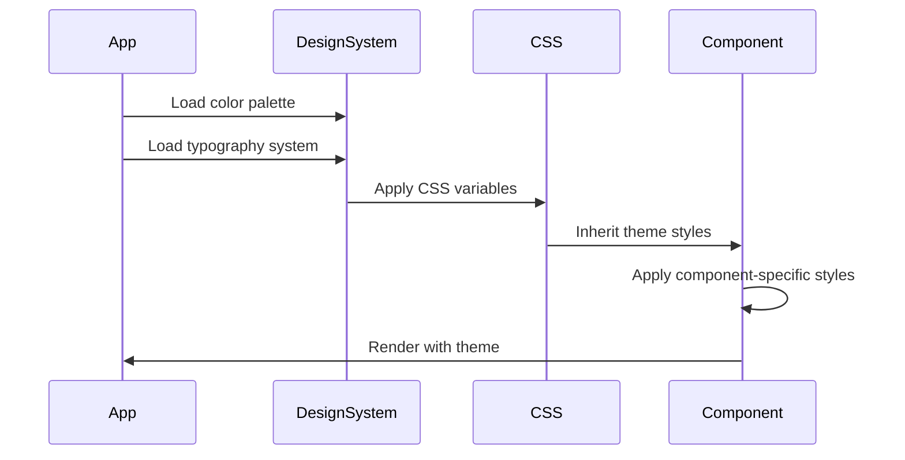

# Design Document: Simplified Landing Page

## Overview

The simplified landing page redesign focuses on improving user experience through streamlined scrolling behavior, enhanced visual design system, and refined typography. The design maintains all existing functionality (hero slideshow, products, announcements, calendar, officers) while introducing a cleaner, more modern aesthetic with hidden scrollbars, improved color palette, and proper typographic hierarchy using Bebas Neue font family.

## Architecture



## Components and Interfaces

### Component 1: PageWrapper

**Purpose**: Root container managing global scrolling behavior and theme application


**Interface**:
```typescript
interface PageWrapperProps {
  children: React.ReactNode;
  className?: string;
}

interface ScrollBehavior {
  scrollbarWidth: 'none' | 'thin';
  overflowY: 'auto' | 'scroll';
  scrollBehavior: 'smooth' | 'auto';
}
```

**Responsibilities**:
- Apply global scrolling behavior with hidden scrollbar
- Manage smooth scroll transitions
- Apply theme colors and background
- Ensure responsive layout across all devices

### Component 2: HeroSection

**Purpose**: Display rotating slideshow with overlay content and call-to-action

**Interface**:
```typescript
interface HeroSectionProps {
  slides: SlideImage[];
  title: string;
  subtitle: string;
  description: string;
}

interface SlideImage {
  url: string;
  alt: string;
  animationDelay: number;
}
```

**Responsibilities**:
- Manage slideshow animation timing (6 slides, 30s cycle)
- Display hero content with proper typography hierarchy
- Apply overlay for content readability
- Maintain responsive height (70vh desktop, 50vh tablet, 45vh mobile)


### Component 3: ProductsSection

**Purpose**: Display product catalog in responsive grid layout

**Interface**:
```typescript
interface ProductsSectionProps {
  products: Product[];
  loading: boolean;
  onOrderClick: (product: Product) => void;
}

interface Product {
  productId: string;
  productName: string;
  description: string;
  price: number;
  stockAvailable: number;
  imageUrl: string;
  sizeOptions?: string[];
  colorVariations?: string[];
}
```

**Responsibilities**:
- Render products in responsive grid (auto-fill, minmax(320px, 1fr))
- Display product cards with hover effects
- Show stock status badges (low stock, out of stock)
- Handle loading and empty states
- Manage order button interactions

### Component 4: AnnouncementsSection

**Purpose**: Display announcements in horizontal scrollable slider

**Interface**:
```typescript
interface AnnouncementsSectionProps {
  announcements: Announcement[];
  onExpand: (id: string) => void;
  expandedId: string | null;
}

interface Announcement {
  id: string;
  title: string;
  description: string;
  category: string;
  eventDate: string;
  eventTime: string;
  venue: string;
  imageBase64?: string;
}
```


**Responsibilities**:
- Render horizontal scrollable slider with hidden scrollbar
- Display announcement cards with fixed height (600px)
- Handle expand/collapse interactions
- Provide navigation arrows for slider control
- Apply category-based color coding

### Component 5: OfficersSection

**Purpose**: Display officer profiles in responsive grid

**Interface**:
```typescript
interface OfficersSectionProps {
  officers: Officer[];
}

interface Officer {
  docId: string;
  name: string;
  position: string;
  description?: string;
  image64?: string;
  facebookLink?: string;
  twitterLink?: string;
  instagramLink?: string;
}
```

**Responsibilities**:
- Render officers in responsive grid (auto-fit, minmax(220px, 1fr))
- Display officer cards with circular profile images
- Show social media links
- Apply position-based sorting
- Handle hover effects and transitions

## Data Models

### Model 1: DesignSystem

```typescript
interface DesignSystem {
  colors: ColorPalette;
  typography: TypographySystem;
  spacing: SpacingSystem;
  scrollbar: ScrollbarConfig;
}
```


**Color Palette**:
```typescript
interface ColorPalette {
  // Primary colors - Refined warm tones
  primary: {
    burgundy: '#6B1F1F';      // Main background (lighter than #4c1515)
    deepRed: '#8B2828';       // Secondary background (lighter than #5a1a1a)
    crimson: '#A63232';       // Tertiary background (lighter than #732020)
  };
  
  // Accent colors
  accent: {
    orange: '#FF6B35';        // Primary accent (softer than #fe5c03)
    orangeHover: '#FF8555';   // Hover state
    orangeLight: 'rgba(255, 107, 53, 0.2)'; // Transparent overlay
  };
  
  // Neutral colors
  neutral: {
    white: '#FFFFFF';
    lightGray: '#F5F5F5';
    mediumGray: '#D0D0D0';
    darkGray: '#808080';
    charcoal: '#3A3A3A';
  };
  
  // Semantic colors
  semantic: {
    success: '#4CAF50';
    warning: '#FF9800';
    error: '#F44336';
    info: '#2196F3';
  };
}
```

**Typography System**:
```typescript
interface TypographySystem {
  fontFamilies: {
    display: 'Bebas Neue, sans-serif';     // Headings and titles
    body: 'Inter, system-ui, sans-serif';  // Body text (replacing Arial)
  };
  
  fontSizes: {
    // Desktop sizes
    h1: '4.5rem';      // Hero title (reduced from 5.5rem)
    h2: '3rem';        // Section titles (reduced from 3.5rem)
    h3: '1.5rem';      // Card titles
    body: '1rem';      // Base body text
    small: '0.875rem'; // Small text
  };
  
  fontWeights: {
    regular: 400;
    medium: 500;
    semibold: 600;
    bold: 700;
  };
  
  lineHeights: {
    tight: 1.2;
    normal: 1.5;
    relaxed: 1.8;
  };
  
  letterSpacing: {
    tight: '-0.02em';
    normal: '0';
    wide: '0.05em';
  };
}
```


**Spacing System**:
```typescript
interface SpacingSystem {
  // Base unit: 0.25rem (4px)
  xs: '0.5rem';    // 8px
  sm: '1rem';      // 16px
  md: '1.5rem';    // 24px
  lg: '2rem';      // 32px
  xl: '3rem';      // 48px
  xxl: '5rem';     // 80px
  
  // Section padding
  sectionPadding: {
    desktop: '5rem 2rem';
    tablet: '3rem 1rem';
    mobile: '2rem 0.8rem';
  };
}
```

**Scrollbar Configuration**:
```typescript
interface ScrollbarConfig {
  // Hide scrollbar while maintaining functionality
  webkit: {
    display: 'none';
  };
  firefox: {
    scrollbarWidth: 'none';
  };
  ie: {
    msOverflowStyle: 'none';
  };
  
  // Smooth scrolling behavior
  scrollBehavior: 'smooth';
  overflowY: 'auto';
}
```

### Model 2: ResponsiveBreakpoints

```typescript
interface ResponsiveBreakpoints {
  xs: '320px';   // Extra small devices
  sm: '480px';   // Small phones
  md: '640px';   // Large phones
  lg: '768px';   // Tablets
  xl: '1024px';  // Small desktops
  xxl: '1440px'; // Large desktops
}
```

## Sequence Diagrams

### User Scrolling Interaction




### Announcements Slider Navigation



### Theme Application Flow



## Correctness Properties

*A property is a characteristic or behavior that should hold true across all valid executions of a system—essentially, a formal statement about what the system should do. Properties serve as the bridge between human-readable specifications and machine-verifiable correctness guarantees.*

### Property 1: Scrollbar Hiding with Smooth Scrolling

*For any* scrollable container in the system, the scrollbar must be hidden using browser-specific CSS properties while maintaining scroll functionality and smooth scroll behavior.

**Validates: Requirements 1.1, 1.2, 1.3, 6.2, 6.6**

### Property 2: Typography System for Headings

*For any* heading or display text element, the font family must be Bebas Neue with appropriate fallbacks.

**Validates: Requirements 3.1**

### Property 3: Typography System for Body Text

*For any* body text element, the font family must be Inter with appropriate fallbacks.

**Validates: Requirements 3.2**

### Property 4: Font Fallback Chain

*For any* font-family declaration, if the primary font fails to load, the system must fallback to system fonts defined in the font stack.

**Validates: Requirements 3.7**

### Property 5: Color Palette Consistency

*For any* style declaration in the codebase, all color values must come from the defined color palette with no hardcoded hex values outside the design system.

**Validates: Requirements 2.7**

### Property 6: CSS Custom Properties for Colors

*For any* color in the color palette, it must be defined as a CSS custom property (CSS variable).

**Validates: Requirements 2.6**

### Property 7: Hero Section Content Display

*For any* hero section render, it must display title, subtitle, and description overlay content.

**Validates: Requirements 4.2**

### Property 8: Hero Slideshow Transitions

*For any* transition between hero slideshow images, smooth CSS transitions must be applied.

**Validates: Requirements 4.6**

### Property 9: Grid Layout for Sections

*For any* section that displays multiple items (products, officers), the layout must use CSS Grid with responsive column configuration.

**Validates: Requirements 5.1, 7.1**

### Property 10: Stock Status Badge Display

*For any* product with low stock (stockAvailable < threshold), a low stock badge must be displayed.

**Validates: Requirements 5.3**

### Property 11: Out of Stock Badge Display

*For any* product with zero stock (stockAvailable = 0), an out of stock badge must be displayed.

**Validates: Requirements 5.4**

### Property 12: Interactive Element Hover Effects

*For any* interactive element (product cards, officer cards), hover effects must be applied via CSS hover states.

**Validates: Requirements 5.5, 7.6**

### Property 13: Announcements Slider Navigation

*For any* click on announcements slider navigation buttons (next/prev), the slider must scroll by exactly 320px with smooth scroll behavior.

**Validates: Requirements 6.4, 6.6**

### Property 14: Announcement Expansion

*For any* announcement card click, the system must toggle the expanded state for that announcement.

**Validates: Requirements 6.5**

### Property 15: Category-Based Color Coding

*For any* announcement with a category, category-based color coding must be applied to the announcement card.

**Validates: Requirements 6.7**

### Property 16: Circular Officer Images

*For any* officer profile image, the image must be displayed with circular border-radius styling.

**Validates: Requirements 7.3**

### Property 17: Social Media Icons Display

*For any* officer with social media links (Facebook, Twitter, Instagram), clickable social media icons must be displayed.

**Validates: Requirements 7.4**

### Property 18: Officer Position Sorting

*For any* list of officers, they must be sorted by position before rendering.

**Validates: Requirements 7.5**

### Property 19: Responsive Layout Adaptation

*For any* viewport width change, components must adapt their layout according to the appropriate responsive breakpoint without triggering horizontal overflow.

**Validates: Requirements 8.2, 8.3**

### Property 20: Image Loading Fallback

*For any* product image that fails to load, an onError handler must replace the src with a fallback image URL.

**Validates: Requirements 9.1**

### Property 21: Lazy Loading for Images

*For any* image below the fold, lazy loading must be implemented using loading="lazy" attribute or intersection observer.

**Validates: Requirements 9.2**

### Property 22: Responsive Image Sizing

*For any* image element, appropriate sizing must be applied based on the current viewport breakpoint.

**Validates: Requirements 9.3**

### Property 23: Image URL Validation

*For any* image URL before rendering, validation must occur to ensure the URL is properly formatted and from trusted sources.

**Validates: Requirements 9.5**

### Property 24: CSS Transform Animations

*For any* animation in the system, CSS transforms must be used instead of position property changes.

**Validates: Requirements 10.1**

### Property 25: Hardware Acceleration

*For any* scroll animation, hardware acceleration must be applied using transform: translateZ(0) or will-change property.

**Validates: Requirements 10.2**

### Property 26: Debounced Scroll Handlers

*For any* scroll event listener, the handler must be wrapped with a debounce function to optimize performance.

**Validates: Requirements 10.3**

### Property 27: Loading State Display

*For any* data fetching operation (products, announcements, officers), a loading state indicator must be displayed while the fetch is in progress.

**Validates: Requirements 11.4**

### Property 28: Firebase Error Handling

*For any* Firebase connection failure, an error message must be displayed to the user.

**Validates: Requirements 11.5**

### Property 29: Data Structure Validation

*For any* data received from Firebase, the structure must be validated against the expected interface before rendering.

**Validates: Requirements 11.6**

### Property 30: Content Sanitization

*For any* user-generated content from Firebase (announcements, officer descriptions), the content must be sanitized before rendering to prevent XSS attacks.

**Validates: Requirements 12.1**

### Property 31: Base64 Image Validation

*For any* base64 image data in announcements, validation must occur to ensure the data is properly formatted.

**Validates: Requirements 12.2**

### Property 32: Social Media Link Validation

*For any* social media link for officers, URL validation must occur to ensure the link is properly formatted and safe.

**Validates: Requirements 12.3**

### Property 33: HTML Escaping in Descriptions

*For any* announcement description containing HTML, the HTML must be escaped before rendering.

**Validates: Requirements 12.4**

### Property 34: Trusted Domain Restriction

*For any* external image source, the domain must be validated against a whitelist of trusted domains.

**Validates: Requirements 12.5**

## Error Handling

### Error Scenario 1: Missing Product Images

**Condition**: Product image URL fails to load or is undefined
**Response**: Display fallback image from Unsplash
**Recovery**: Apply onError handler to replace src with default image URL

### Error Scenario 2: Empty Data States

**Condition**: No products, announcements, or officers available from Firebase
**Response**: Display appropriate empty state message with styling
**Recovery**: Show user-friendly message ("No products available at the moment. Check back soon!")

### Error Scenario 3: Scrollbar Not Hidden

**Condition**: Browser doesn't support CSS scrollbar hiding
**Response**: Apply multiple fallback methods (webkit, firefox, IE)
**Recovery**: Ensure at least one method works across all browsers


### Error Scenario 4: Typography Font Loading Failure

**Condition**: Bebas Neue or Inter font fails to load from CDN
**Response**: Fallback to system fonts (sans-serif for Bebas Neue, system-ui for Inter)
**Recovery**: Define font-family with fallback stack in CSS

## Testing Strategy

### Unit Testing Approach

**Component Testing**:
- Test each section component renders correctly with mock data
- Verify scrollbar hiding CSS is applied to all scrollable containers
- Test typography system applies correct font families and sizes
- Verify color palette values are used consistently
- Test responsive breakpoints trigger correct styles

**Interaction Testing**:
- Test announcement slider navigation (prev/next buttons)
- Test announcement expand/collapse functionality
- Test product order button click handlers
- Test smooth scroll behavior on page navigation

**Visual Regression Testing**:
- Capture screenshots at each breakpoint (320px, 480px, 768px, 1024px, 1440px)
- Compare before/after color palette changes
- Verify typography rendering across different browsers
- Test scrollbar visibility across browsers

### Property-Based Testing Approach

**Property Test Library**: fast-check (for React/TypeScript)

**Test Properties**:

1. **Scrollbar Hiding Property**:
   - Generate random scroll positions
   - Verify scrollbar remains hidden at all scroll positions
   - Check scroll functionality works despite hidden scrollbar

2. **Color Palette Property**:
   - Generate random component instances
   - Verify all color values match ColorPalette enum
   - Check no hardcoded hex values outside design system

3. **Typography Property**:
   - Generate random text elements
   - Verify font-family matches typography system
   - Check font-size values are from defined scale

4. **Responsive Layout Property**:
   - Generate random viewport widths
   - Verify no horizontal overflow at any width
   - Check components adapt to breakpoints correctly


### Integration Testing Approach

**Firebase Integration**:
- Test products fetch from Firestore collection
- Test announcements fetch with real-time updates
- Test officers fetch with position-based sorting
- Verify loading states during data fetch
- Test error handling for Firebase connection failures

**Browser Compatibility**:
- Test scrollbar hiding in Chrome, Firefox, Safari, Edge
- Verify smooth scroll behavior across browsers
- Test font rendering consistency
- Verify CSS Grid layout support

## Performance Considerations

**Image Optimization**:
- Lazy load images below the fold (products, officers, announcements)
- Use appropriate image sizes for different breakpoints
- Implement progressive image loading for hero slideshow
- Cache Firebase image URLs in browser storage

**Scroll Performance**:
- Use CSS `will-change: transform` for smooth scrolling
- Debounce scroll event listeners
- Use `requestAnimationFrame` for scroll animations
- Minimize repaints during scroll

**Animation Performance**:
- Use CSS transforms instead of position changes
- Apply `transform: translateZ(0)` for hardware acceleration
- Limit simultaneous animations (hero slideshow uses staggered delays)
- Use `animation-fill-mode: forwards` to prevent reflows

**Bundle Size**:
- Import only necessary Firebase modules
- Use CSS modules for scoped styling (already implemented)
- Minimize inline styles, prefer CSS classes
- Consider code splitting for CalendarWidget component

## Security Considerations

**XSS Prevention**:
- Sanitize user-generated content from Firebase (announcements, officer descriptions)
- Use React's built-in XSS protection (JSX escaping)
- Validate image URLs before rendering
- Escape HTML in announcement descriptions

**Data Validation**:
- Validate product data structure from Firebase
- Check for required fields before rendering
- Handle malformed data gracefully
- Implement type checking with TypeScript interfaces


**Content Security**:
- Validate base64 image data for announcements
- Implement Content Security Policy headers
- Restrict external image sources to trusted domains
- Sanitize social media links for officers

## Dependencies

**Core Dependencies**:
- React 18+ (already in use)
- Firebase SDK (firestore) - already integrated
- React Router (useNavigate) - already integrated

**Font Dependencies**:
- Bebas Neue (Google Fonts or local) - already in use
- Inter (Google Fonts) - NEW: to replace Arial for body text

**Development Dependencies**:
- TypeScript (for type safety)
- CSS Modules (already in use)
- ESLint (code quality)
- Prettier (code formatting)

**Testing Dependencies**:
- Jest (unit testing)
- React Testing Library (component testing)
- fast-check (property-based testing)
- Playwright or Cypress (E2E testing)

**Optional Dependencies**:
- react-intersection-observer (lazy loading images)
- react-spring (advanced animations)
- lodash.debounce (scroll event optimization)

## Implementation Notes

**CSS Scrollbar Hiding**:
```css
/* Apply to .pageWrapper and .announcementsSlider */
.scrollableContainer {
  overflow-y: auto;
  scroll-behavior: smooth;
  
  /* Hide scrollbar for Chrome, Safari and Opera */
  &::-webkit-scrollbar {
    display: none;
  }
  
  /* Hide scrollbar for IE, Edge and Firefox */
  -ms-overflow-style: none;  /* IE and Edge */
  scrollbar-width: none;  /* Firefox */
}
```

**Typography Implementation**:
```css
/* Import Inter font */
@import url('https://fonts.googleapis.com/css2?family=Inter:wght@400;500;600;700&display=swap');

/* Apply to body text */
body, p, span, div {
  font-family: 'Inter', system-ui, -apple-system, sans-serif;
}

/* Bebas Neue remains for headings */
h1, h2, h3, .heroTitle, .sectionTitle {
  font-family: 'Bebas Neue', sans-serif;
  letter-spacing: 0.02em;
}
```


**Color Palette Implementation**:
```css
/* Define CSS custom properties for color system */
:root {
  /* Primary colors */
  --color-burgundy: #6B1F1F;
  --color-deep-red: #8B2828;
  --color-crimson: #A63232;
  
  /* Accent colors */
  --color-orange: #FF6B35;
  --color-orange-hover: #FF8555;
  --color-orange-light: rgba(255, 107, 53, 0.2);
  
  /* Neutral colors */
  --color-white: #FFFFFF;
  --color-light-gray: #F5F5F5;
  --color-medium-gray: #D0D0D0;
  --color-dark-gray: #808080;
  --color-charcoal: #3A3A3A;
  
  /* Semantic colors */
  --color-success: #4CAF50;
  --color-warning: #FF9800;
  --color-error: #F44336;
  --color-info: #2196F3;
}

/* Replace hardcoded colors */
.pageWrapper {
  background-color: var(--color-burgundy);
}

.productsSection {
  background-color: var(--color-deep-red);
}

.productCard {
  background-color: var(--color-crimson);
}

.heroTitle, .sectionTitle {
  color: var(--color-orange);
}
```

**Responsive Typography Scale**:
```css
/* Desktop (default) */
.heroTitle {
  font-size: 4.5rem;
  line-height: 1.2;
}

.sectionTitle {
  font-size: 3rem;
  line-height: 1.2;
}

/* Tablet */
@media (max-width: 768px) {
  .heroTitle {
    font-size: 2.5rem;
  }
  
  .sectionTitle {
    font-size: 2rem;
  }
}

/* Mobile */
@media (max-width: 480px) {
  .heroTitle {
    font-size: 1.8rem;
  }
  
  .sectionTitle {
    font-size: 1.5rem;
  }
}
```

## Migration Strategy

**Phase 1: Design System Setup**
1. Create CSS custom properties for color palette
2. Import Inter font from Google Fonts
3. Define typography scale variables
4. Set up scrollbar hiding utilities

**Phase 2: Component Updates**
1. Update PageWrapper with scrollbar hiding
2. Replace hardcoded colors with CSS variables
3. Update typography to use Inter for body text
4. Adjust font sizes according to new scale

**Phase 3: Testing & Refinement**
1. Test scrollbar hiding across browsers
2. Verify color contrast ratios for accessibility
3. Test responsive typography at all breakpoints
4. Validate smooth scroll behavior

**Phase 4: Performance Optimization**
1. Implement lazy loading for images
2. Optimize animation performance
3. Add debouncing for scroll events
4. Measure and optimize bundle size
