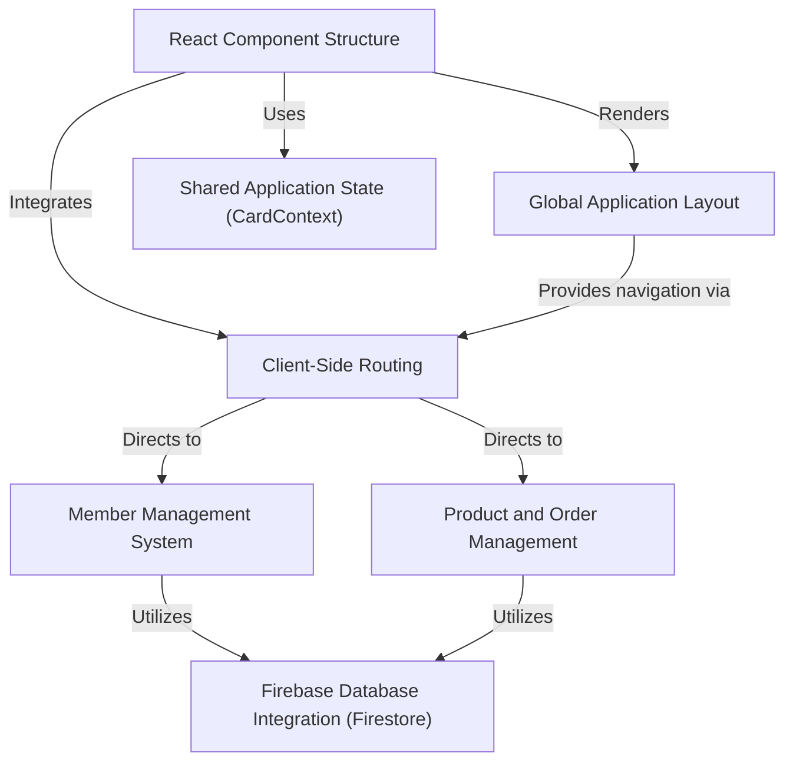

# Tutorial: Prototype-SSG-Office-Assistant-App

The **SSG Office Assistant App** is a *React-based admin dashboard* designed to help student leaders efficiently manage their organization. It provides comprehensive tools to **add, view, edit, and delete student member profiles**, and also includes a system for **managing products and processing customer orders** online, aiming to streamline administrative tasks and improve service to students.

## Visual Overview

## Chapters

1. [Global Application Layout
](01_global_application_layout_.md)
2. [React Component Structure
](02_react_component_structure_.md)
3. [Client-Side Routing
](03_client_side_routing_.md)
4. [Firebase Database Integration (Firestore)
](04_firebase_database_integration__firestore__.md)
5. [Member Management System
](05_member_management_system_.md)
6. [Product and Order Management
](06_product_and_order_management_.md)
7. [Shared Application State (CardContext)
](07_shared_application_state__cardcontext__.md)

---
