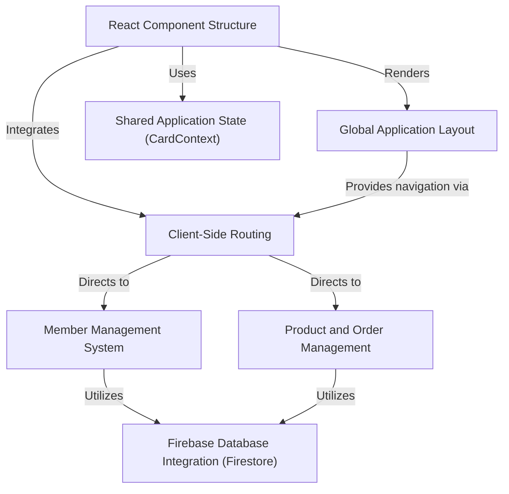

# Tutorial: Prototype-SSG-Office-Assistant-App

The **SSG Office Assistant App** is a *React-based admin dashboard* designed to help student leaders efficiently manage their organization. It provides comprehensive tools to **add, view, edit, and delete student member profiles**, and also includes a system for **managing products and processing customer orders** online, aiming to streamline administrative tasks and improve service to students.

## Recent Updates (May 2026)

### ✅ Track My Order Feature
Complete order tracking system allowing users to search orders by Order ID or Email, with real-time status updates and visual progress indicators. See `Documentations/TRACK_ORDER_FEATURE.md` for details.

### ✅ Commerce Hub for Representatives
Unified portal combining Order Management and Product Management with tabbed interface, specifically designed for representative roles. See `Documentations/COMMERCE_HUB_FEATURE.md` for details.

### ✅ Login Password Toggle
Enhanced login security with show/hide password button featuring eye icon and accessibility support. See `Documentations/LOGIN_PASSWORD_TOGGLE_FEATURE.md` for details.

### ✅ Calendar Widget Redesign
Complete visual redesign matching Homepage's editorial dark mode theme with full day card color changes based on event types (Class, Exam, Event, Holiday, Meeting). See `Documentations/CALENDAR_WIDGET_REDESIGN.md` for details.

### ✅ Officers Carousel
Transformed Officers section from scrolling grid to interactive carousel with arrow navigation, dot indicators, and responsive behavior (3 cards on desktop, 2 on tablet, 1 on mobile). See `Documentations/OFFICERS_CAROUSEL_FEATURE.md` for details.

## Visual Overview

```mermaid
flowchart TD
    A0["React Component Structure
"]
    A1["Client-Side Routing
"]
    A2["Firebase Database Integration (Firestore)
"]
    A3["Member Management System
"]
    A4["Product and Order Management
"]
    A5["Global Application Layout
"]
    A6["Shared Application State (CardContext)
"]
    A0 -- "Renders" --> A5
    A0 -- "Integrates" --> A1
    A0 -- "Uses" --> A6
    A3 -- "Utilizes" --> A2
    A4 -- "Utilizes" --> A2
    A1 -- "Directs to" --> A3
    A1 -- "Directs to" --> A4
    A5 -- "Provides navigation via" --> A1
```

## Chapters

1. [Global Application Layout
](01_global_application_layout_.md)
2. [React Component Structure
](02_react_component_structure_.md)
3. [Client-Side Routing
](03_client_side_routing_.md)
4. [Firebase Database Integration (Firestore)
](04_firebase_database_integration__firestore__.md)
5. [Member Management System
](05_member_management_system_.md)
6. [Product and Order Management
](06_product_and_order_management_.md)
7. [Shared Application State (CardContext)
](07_shared_application_state__cardcontext__.md)

---
