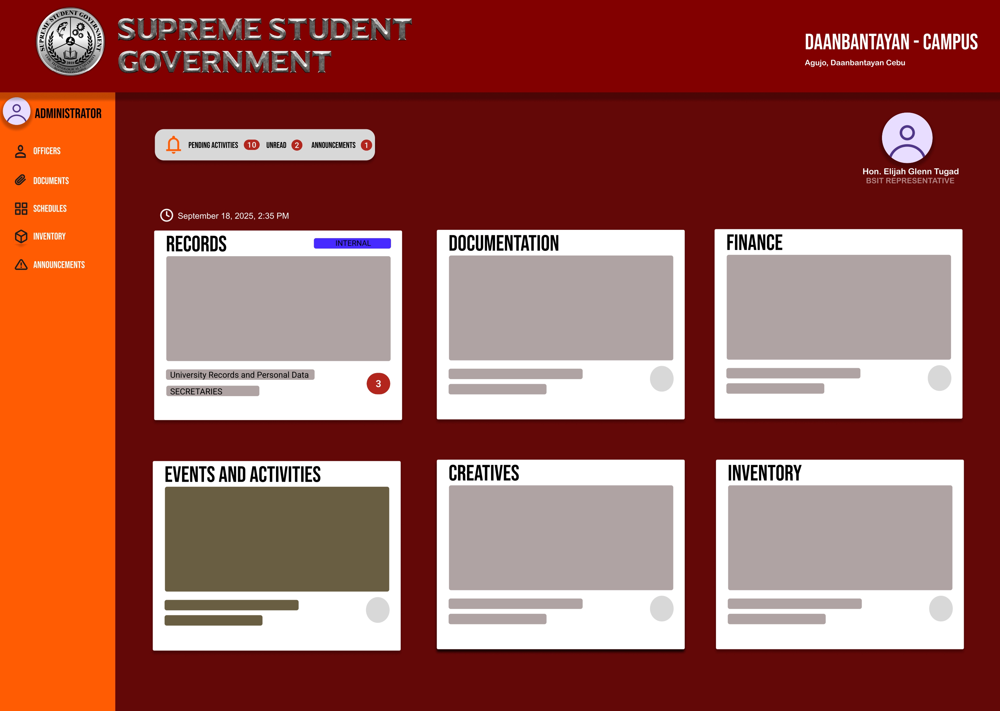

# 🧑‍💼 Prototype: SSG Office Assistant App (Admin Dashboard)

## 📘 Overview
The **SSG Office Assistant App** is a React-based admin dashboard designed to help student leaders efficiently manage and organize member data.  
It allows administrators to **add**, **view**, **edit**, and **delete** member profiles that include personal and organizational information such as name, ID, address, position, and photo.

---

## 🚀 Current Progress (as of October 2025)

### ✅ Phase 1: UI & Frontend Setup — *Completed*
- Project initialized with **React.js (Vite)**.
- Folder structure established (`components`, `styles`, etc.).
- `Admin.jsx` and `Dashboard.jsx` pages created.
- Connected styles using **vanilla CSS modules**.

### ✅ Phase 2: Member Management System — *Completed*
- Added **Member Dashboard** page (`MemberDashboard.jsx`).
- Integrated form inputs for:
  - Full Name
  - ID Number
  - Address
  - Position (dropdown)
  - Photo upload and live preview
- Implemented **Add Member** functionality using React `useState`.

### ✅ Phase 3: Member Listing & Card Layout — *Completed*
- Created `Memberlist.jsx` component to dynamically display added members.
- Styled member cards with name, ID, position, and uploaded photo.
- Implemented responsive card layout using **Flexbox**.

### ✅ Phase 4: Edit & Delete Functionalities — *Completed*
- Added ✏️ **Edit** and 🗑️ **Delete** buttons on each card.
- Editing a member pre-fills the form for quick updates.
- Delete confirmation ensures safe removal.
- Updated state management logic for clean and bug-free re-rendering.

---

## 🔧 Technologies Used
- **React.js (Vite)** — Component-based architecture
- **JavaScript (ES6)** — Logic and interactivity
- **HTML5 + Vanilla CSS** — Structure and styling
- **React Hooks** — For handling component states (`useState`)
- **Git + GitHub** — Version control and remote repository

---

## 🧱 Project Structure
📂 Shirio/
┣ 📁 src/
┃ ┣ 📁 components/
┃ ┃ ┣ 📜 Admin.jsx
┃ ┃ ┣ 📜 Dashboard.jsx
┃ ┃ ┣ 📜 MemberDashboard.jsx
┃ ┃ ┗ 📜 Memberlist.jsx
┃ ┣ 📁 styles/
┃ ┃ ┗ 📜 memberdashboard.module.css
┃ ┗ 📜 main.jsx
┣ 📜 package.json
┣ 📜 README.md
┗ 📜 index.html

yaml
Copy code

---

## 🎯 Upcoming Features (Planned)
- 🔐 **Authentication System** (Admin login before accessing dashboard)
- ☁️ **Firebase Integration** (Store member data and photos online)
- 📱 **Responsive Design Enhancements** for mobile screens
- 🧩 **Search & Filter Members** by name or position
- 📤 **Export Members List** (CSV or PDF report)

---

## 🖼️ Preview
*
*

---

## 🧠 Developer Notes
> The project demonstrates key React concepts such as component reusability, controlled forms, and state lifting between components.  
> This will later evolve into a full **Student Government Office Management System**, integrating data storage, authentication, and member analytics.

---

## 🧑‍💻 Contributors
- **Elijah Tugad** — Developer & Designer

# My Awesome Project

Welcome! To learn more about setting up the project, see our 
[**Installation Guide**](Tutorial.md).

---

## 📅 Last Updated
**October 26, 2025**

---
